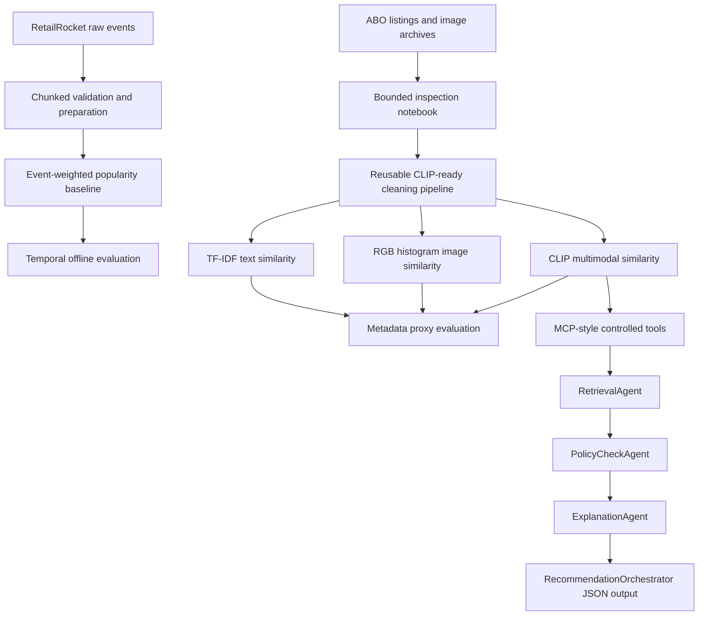

# Product Recommendation System

A multimodal AI/ML recommendation system that relates and ranks products using three complementary signal types: user behavioral interactions, product text, and product images. It is built on two independent real-world dataset tracks, RetailRocket behavior events and Amazon Berkeley Objects (ABO) product metadata and images, and covers a structured local engineering workflow from dataset discovery and reusable cleaning through baseline and multimodal similarity models, offline evaluation, and a controlled agentic recommendation workflow.

The project is a reproducible local research and engineering workflow backed by scripted pipelines and a fixture-based test suite. It is not deployed as a production API or service. FastAPI serving, a vector database, a standards-compliant MCP server, monitoring, and deployment infrastructure are roadmap items, not current capabilities.

### At a Glance

| | |
| --- | --- |
| Signals | Behavioral events, product text, product images |
| Dataset tracks | RetailRocket (real interaction events), Amazon Berkeley Objects (real product metadata and images) |
| Methods | Event-weighted popularity, TF-IDF text similarity, RGB histogram image similarity, CLIP text-image similarity |
| Stack | Python, CUDA-enabled PyTorch, Transformers, scikit-learn, pandas, NumPy, Pillow, pytest |
| Tests | Fixture-based automated test suite; raw datasets are not required |
| Delivery status | Local workflow and offline evaluation; not a deployed service |

## Business Problem

E-commerce recommendation systems need to serve different recommendation needs:

- Behavior-based ranking from observed interactions such as views, cart additions, and transactions.
- Product-to-product similarity when user behavior is unavailable or when catalog exploration is the primary task.
- Multimodal comparison that combines product text with visual information.
- Controlled explanation of fixed recommendations without allowing an LLM to select or rerank products.

This repository addresses those needs through separate dataset-specific tracks. It does not fabricate identity mappings between datasets.

## Current Status

| Area | Status |
| --- | --- |
| RetailRocket data discovery and behavior baseline | Implemented |
| RetailRocket temporal offline evaluation | Implemented |
| ABO real-data inspection and reusable cleaning | Implemented |
| ABO TF-IDF text similarity | Implemented |
| ABO RGB histogram image similarity | Implemented |
| ABO CLIP text-image similarity | Implemented |
| Local/offline CLIP model loading | Implemented |
| ABO metadata-based proxy evaluation | Implemented |
| Lightweight agentic recommendation demo | Implemented |
| MCP-style controlled tool interfaces | Implemented as a local abstraction, not a full MCP server |
| FastAPI, vector database, monitoring, and deployment | Not implemented |

The test suite is intended to run against committed deterministic fixtures without requiring raw datasets. Test results are local quality evidence, not a claim of production deployment readiness.

## Current Framework Checkpoint

This repository is currently a **Portfolio-level local AI/ML engineering project** under the Enterprise AI/ML Engineering Framework v2.1.0. The last completed checkpoint is **Baseline Complete**: Data is complete for the current local scope, RetailRocket and ABO baselines exist, and Evaluation is partial.

The active milestone is **Data and Evaluation Evidence Hardening**. Delivery, Production, and Maintenance remain open. FastAPI, vector database, monitoring, rollback, deployment, and production operation are roadmap-only items unless future repository evidence proves otherwise.

## Architecture Overview



RetailRocket and ABO remain independent throughout this architecture. RetailRocket `visitorid` and `itemid` values are never treated as ABO `item_id` or `image_id` values.

## Dataset Tracks

### RetailRocket Behavior Track

Purpose: behavior-based recommendation from real event data.

Expected raw files under `data/raw/RetailRocket_event-based/`:

- `events.csv`
- `item_properties_part1.csv`
- `item_properties_part2.csv`
- `category_tree.csv`

Observed event types include `view`, `addtocart`, and `transaction`. The implemented baseline is an event-weighted global popularity recommender evaluated with a temporal split.

### Amazon Berkeley Objects Track

Purpose: product-to-product similarity using real product text and images.

Expected raw files under `data/raw/amazon_berkeley_text_images-based/`:

- `abo-listings.tar`
- `abo-images-small.tar`
- `README.md`

The ABO workflow reads compressed metadata directly from the tar archives without extracting the full datasets. Image mapping follows:

```text
main_image_id -> images/metadata/images.csv.gz image_id
              -> CSV path
              -> images/small/{path} inside abo-images-small.tar
```

The cleaned product table contains normalized product text, resolved image paths, and CLIP-readiness flags. The current 5,000-record cleaning run scanned 5,000 listings and wrote 4,971 CLIP-ready records.

## Implemented Components

### Data and Validation

- Safe dataset discovery scripts for both tracks.
- Bounded ABO inspection notebook: `notebooks/03_abo_data_inspection.ipynb`.
- Track-specific deterministic fixtures for tests and CI.
- Reusable ABO cleaning pipeline with multilingual text flattening.
- English-value preference with fallback to the first valid non-empty value.
- Product deduplication and image-path validation.
- No full ABO archive extraction during cleaning or runner preparation.

### Recommendation Methods

- **RetailRocket:** event-weighted popularity ranking.
- **ABO TF-IDF:** cosine similarity over cleaned `combined_text`.
- **ABO RGB histogram:** image-only color histogram similarity.
- **ABO CLIP:** fused product text and image embeddings using `openai/clip-vit-base-patch32` by default.
- **Offline CLIP loading:** optional `--local-files-only` mode uses an existing Hugging Face cache without network checks.

### Evaluation

- RetailRocket temporal offline evaluation against later observed interactions.
- ABO proxy comparison using product metadata because ABO has no user interaction labels.
- Reusable precision, average precision, NDCG, match-rate, diversity-count, and score-summary functions for proxy evaluation.

## Evaluation Results

### RetailRocket Offline Evaluation

The event-weighted popularity baseline was evaluated with a temporal split over real RetailRocket events.

| Metric | Result |
| --- | ---: |
| HitRate@10 | 0.0081645675 |
| Recall@10 | 0.0073435373 |
| Evaluated visitors | 275,826 |

These metrics reflect a global popularity baseline and provide a reference point for future behavior-based methods.

### ABO Proxy Similarity Evaluation

ABO does not contain clicks, carts, purchases, conversions, or explicit relevance judgments. Therefore, the following are **metadata proxy metrics**, not real recommendation-performance metrics. Product-type equality is used as binary proxy relevance.

| Method | Product Type Match@5 | Proxy Precision@5 | Proxy NDCG@5 |
| --- | ---: | ---: | ---: |
| CLIP | 0.80 | 0.80 | 0.7606 |
| TF-IDF | 0.60 | 0.60 | 0.7123 |
| RGB Histogram | 0.00 | 0.00 | 0.0000 |

These results are based on one bounded product sample and query. They indicate behavior under the defined proxy protocol only; they must not be interpreted as click-through, purchase, satisfaction, or production ranking performance.

## Controlled Agentic Recommendation Workflow

The repository includes a lightweight local orchestration demo:

1. `RetrievalAgent` loads the cleaned catalog and fixed similarity output.
2. `PolicyCheckAgent` rejects invalid candidates and prevents recommending the query item itself.
3. `ExplanationAgent` explains the approved structured recommendations.
4. `RecommendationOrchestrator` returns a JSON response with selected and rejected recommendations, policy summaries, assumptions, and limitations.

The tool layer is deliberately described as **MCP-style controlled tool interfaces**, where MCP means **Model Context Protocol**. The current implementation uses local, explicitly defined tool interfaces to structure interactions between the recommendation workflow and supporting functions.

This is not a production MCP implementation. The repository contains no MCP transport, standalone MCP server, or external MCP client integration. A standards-compliant MCP implementation remains a roadmap item.

OpenAI explanation generation is optional. The LLM cannot select, add, remove, or rerank recommendations; it can only rewrite an explanation from structured outputs. If `OPENAI_API_KEY` is absent, the SDK is unavailable, or the request fails, the workflow uses a deterministic explanation.

## Repository Structure

```text
.
├── configs/                              # Configuration placeholders
├── data/
│   ├── raw/                              # Local raw datasets; ignored by Git
│   ├── sample/                           # Tiny deterministic fixtures
│   ├── interim/                          # Intermediate-data placeholder
│   └── processed/                        # Local generated tables and results
├── docs/
│   ├── 01_project_foundation.md
│   ├── 02_system_scope.md
│   ├── 03_architecture.md
│   ├── 04_data_design.md
│   ├── 05_evaluation_plan.md
│   ├── 06_security_governance.md
│   ├── 07_deployment_plan.md
│   └── reports/                          # Dataset and protocol evidence
├── notebooks/
│   └── 03_abo_data_inspection.ipynb
├── scripts/                              # Discovery, cleaning, runners, evaluation, demos
├── src/ecommerce_recommender/
│   ├── agents/                           # Lightweight deterministic agents
│   ├── data/                             # Loading, validation, ABO cleaning
│   ├── evaluation/                       # RetailRocket and ABO evaluation logic
│   ├── mcp_tools/                        # MCP-style controlled tool interfaces
│   └── models/                           # Popularity, TF-IDF, RGB, and CLIP logic
└── tests/unit/                           # Focused unit tests with tiny fixtures
```

## Setup

The project targets Python 3.11 or later and is developed on WSL2 Ubuntu with VS Code.

```bash
python3 -m venv .venv
source .venv/bin/activate
python -m pip install --upgrade pip
python -m pip install -r requirements.txt
python -m pip install -e . --no-deps
```

The core requirements include pandas, NumPy, scikit-learn, Pillow, CUDA-enabled PyTorch, Transformers, and pytest. PyTorch is pinned to a CUDA 13.0 build and resolved from the `cu130` PyTorch index declared at the top of `requirements.txt`.

A GPU is optional. CUDA-enabled PyTorch wheels also execute on CPU-only machines; a compatible NVIDIA GPU and driver are needed only for GPU acceleration. Verify an installation with:

```bash
python -c "import torch; print(torch.__version__, torch.version.cuda, torch.cuda.is_available())"
```

The setup is verified locally on the environment below. This is a development reference point, not a project requirement:

| Component | Verified value |
| --- | --- |
| Python | 3.12.3 |
| PyTorch | 2.12.0+cu130 |
| PyTorch CUDA | 13.0 |
| `torch.cuda.is_available()` | True |
| GPU | NVIDIA GeForce RTX 5060 Laptop GPU |

The OpenAI Python SDK is optional and is not required for cleaning, recommendation methods, evaluation, tests, or deterministic explanations. Install it only if using the optional explanation mode:

```bash
python -m pip install openai
```

## Data Requirements

Raw datasets are not committed. Download them from their official sources and place them at the paths described above.

Do not:

- Commit files under `data/raw/`.
- Join RetailRocket identifiers to ABO identifiers.
- Extract all ABO images for routine inspection or sample runs.
- Treat sample fixtures as the primary ML datasets.

Generated processed artifacts are local outputs and can be reproduced from the raw data and scripts.

## Running Key Workflows

The project has three reproducibility modes:

- Fixture-only tests use committed files under `data/sample/` and should not require raw datasets.
- Raw-data workflows require local files under `data/raw/` and write generated artifacts under ignored `data/processed/`.
- CLIP workflows require PyTorch, Transformers, Pillow, and either an existing Hugging Face model cache or an approved first run without `--local-files-only`.

### RetailRocket Baseline

```bash
python scripts/run_retailrocket_baseline.py
python scripts/evaluate_retailrocket_baseline.py
```

### ABO Data Inspection and Cleaning

Open and run the bounded inspection notebook:

```text
notebooks/03_abo_data_inspection.ipynb
```

Create a bounded cleaned sample:

```bash
python scripts/clean_abo_products.py --max-records 1000
```

Create the 5,000-record table used by the current comparison:

```bash
python scripts/clean_abo_products.py   --max-records 5000   --output data/processed/abo_clean_products_5k.jsonl
```

### ABO Similarity Methods

All three runners use the same bounded ordering from the cleaned JSONL file.

```bash
python scripts/run_abo_text_baseline.py   --input data/processed/abo_clean_products_5k.jsonl   --max-products 100   --top-k 5

python scripts/run_abo_image_similarity.py   --input data/processed/abo_clean_products_5k.jsonl   --max-products 100   --top-k 5

python scripts/run_abo_clip_similarity.py   --input data/processed/abo_clean_products_5k.jsonl   --max-products 100   --top-k 5   --local-files-only
```

Omit `--local-files-only` on the first CLIP run if the pretrained model is not already present in the Hugging Face cache.

### ABO Proxy Evaluation

```bash
python scripts/evaluate_abo_similarity_methods.py   --products data/processed/abo_clean_products_5k.jsonl   --tfidf data/processed/abo_tfidf_similarity_5k_sample.json   --image data/processed/abo_image_similarity_5k_sample.json   --clip data/processed/abo_clip_similarity_5k_sample.json   --output data/processed/abo_similarity_proxy_evaluation.json
```

### Agentic Recommendation Demo

Deterministic mode requires no API key:

```bash
python scripts/run_abo_agentic_recommendation_demo.py
```

Optional OpenAI explanation mode:

```bash
python scripts/run_abo_agentic_recommendation_demo.py   --use-openai-explanation
```

## Running Tests

Run the complete suite:

```bash
python -m pytest -q
```

Run focused areas:

```bash
python -m pytest -q tests/unit/test_clean_abo_products.py
python -m pytest -q tests/unit/test_abo_proxy_similarity.py
python -m pytest -q   tests/unit/test_abo_recommendation_tools.py   tests/unit/test_abo_recommendation_agents.py
```

Both `pytest` and `python -m pytest` work: `pyproject.toml` puts `src` and the repository root on the pytest import path, so package modules and root-level `scripts` modules resolve without per-test `sys.path` changes.

The suite currently reports **112 passing tests** on the verified environment. The exact count changes as tests are added, so treat the command output from your own environment as the source of truth rather than a hardcoded number.

## Continuous Integration

GitHub Actions runs `python -m pytest -q` on pull requests and pushes to `dev` and `main`, using Python 3.11 on a CPU-only `ubuntu-latest` runner. This workflow is a repository quality gate only; it does not deploy the project, run production operations, or imply production readiness.

The workflow installs the same `requirements.txt` used locally, so CI resolves the CUDA-enabled PyTorch build even though hosted runners have no GPU. This is intentional and correct: CUDA-enabled wheels run on CPU, and the suite exercises small deterministic fixtures rather than GPU workloads. The trade-off is install weight, since the CUDA wheel is considerably larger than a CPU-only build and dominates CI setup time.

## Security and Secrets

- `.env` is ignored and must never be committed.
- Never place API keys, tokens, or passwords in source code or generated reports.
- `OPENAI_API_KEY` is optional and used only for explanation rewriting in the local demo.
- `OPENAI_MODEL` can override the optional explanation model.
- The deterministic explanation path remains available without any external API.
- The demo does not print API keys and does not allow the LLM to choose recommendations.

## Limitations

- The system is not deployed behind an API and has no production service-level guarantees.
- RetailRocket results are for a global popularity baseline; personalization and advanced behavior models are not implemented here.
- ABO and RetailRocket cannot be evaluated as one joined system because their identities and business contexts are unrelated.
- ABO proxy relevance may overestimate or underestimate real user satisfaction.
- The current ABO comparison uses a bounded sample and a limited query set, not a comprehensive benchmark.
- RGB histograms capture coarse color distribution rather than high-level product semantics.
- CLIP execution can be compute- and memory-intensive on a laptop.
- The orchestration demo is deterministic workflow coordination with optional explanation rewriting, not autonomous decision-making.
- There is no production MCP server, vector database, RAG pipeline, monitoring stack, or deployment platform in the current implementation.

## Future Roadmap

Planned future work, subject to evaluation evidence and scope approval:

- FastAPI recommendation serving.
- A real vector index such as FAISS for scalable product retrieval.
- A standards-compliant MCP server/client implementation.
- RAG-based grounding for business rules and catalog policies.
- Feedback-aware ranking using legitimate behavior signals.
- Broader human-judgment and multi-query evaluation for ABO similarity.
- Monitoring, model/data drift checks, deployment packaging, and operational readiness.

These items are roadmap targets and should not be interpreted as currently implemented features.


## AI-Assisted Development Disclosure

This project is human-led and AI-assisted. AI tools supported selected planning, documentation, coding assistance, review, debugging, and project-structure decisions. Suggestions are not accepted automatically: all accepted changes, claims, and publication decisions remain under human review and responsibility.

Git/GitHub review practices, tests, documentation review, and evidence-based checks are used before changes are accepted. The use of AI tools does not by itself establish production readiness, safety, reliability, or model quality.

See [`AI_USAGE.md`](AI_USAGE.md) for the full disclosure.
